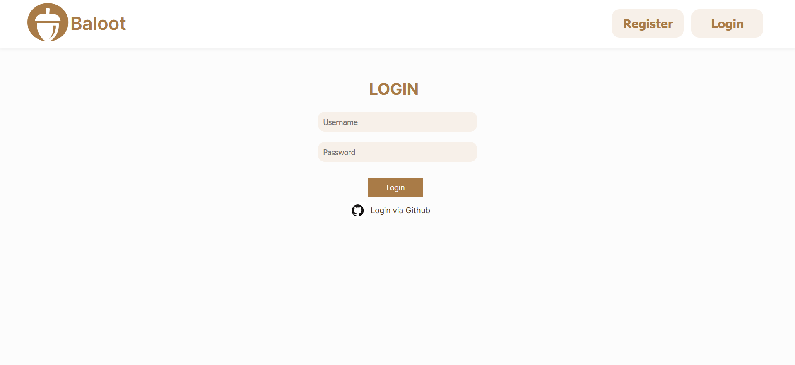
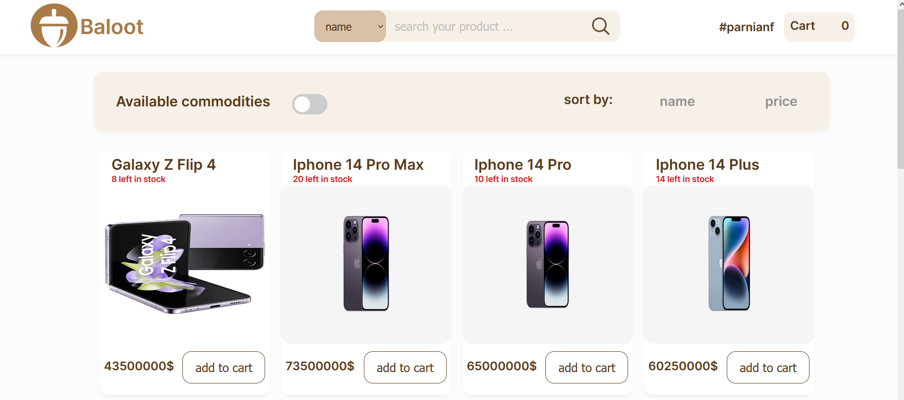
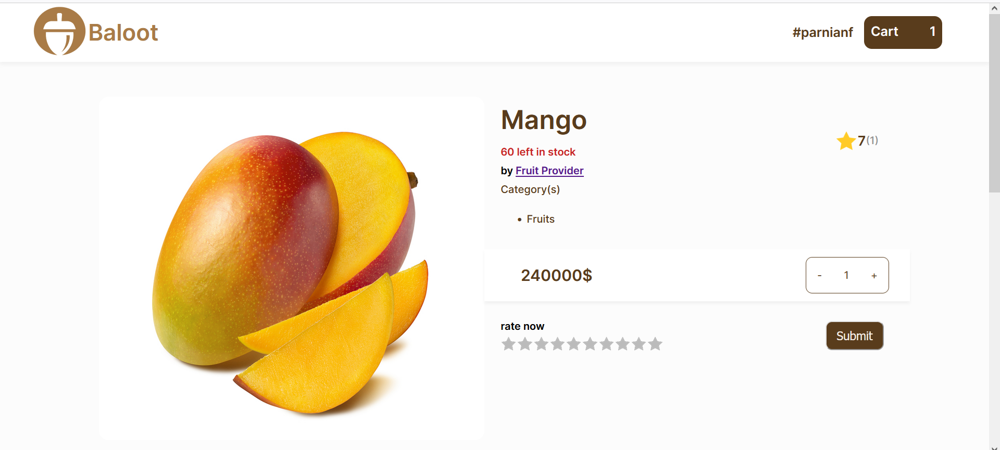
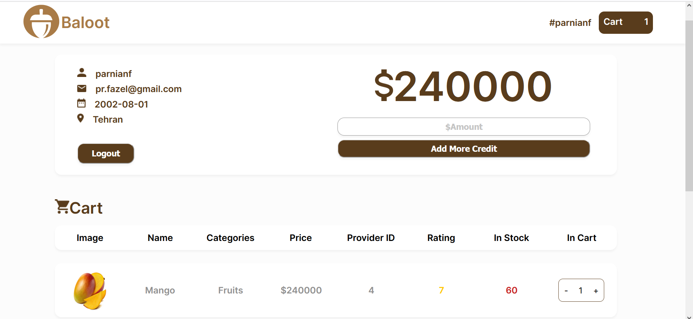

# Baloot

Baloot is a system for purchasing required supplies. In this system, the user can view a list of products presented in different categories, filter products based on their characteristics, create a shopping list, create a favorite list of the products they want, and rate the products.

### Login Page

    

### Home Page

    

### Product Page

    

### User Page

    

* More details of the page design are available [here](https://www.figma.com/file/D4Jx6BQhZNqSVayhrBRT44/Baloot?type=design&node-id=0-1&mode=design).

## Phases

**CA1**: Logic Domain, Git, Maven, Unit Testing (JUnit)

**CA2**: Simple Web Server, Javalin, Jsoup

**CA3**: Tomcat, Servlet, JSP, MVC

**CA4**: html, CSS

**CA5**: React, Spring, CORS Filter, Standard API

**CA6**: MySQL Database, JDBC, ORM, Hibernate

**CA7**: Authentication, JWT, OAuth, JWT Authentication Filter, SQL Injection

**CA8**: Docker, Nginx

## Contributors
* [Parnian Fazel](https://github.com/parnianf/) 
* [Paria Khoshtab](https://github.com/Theparia/)
